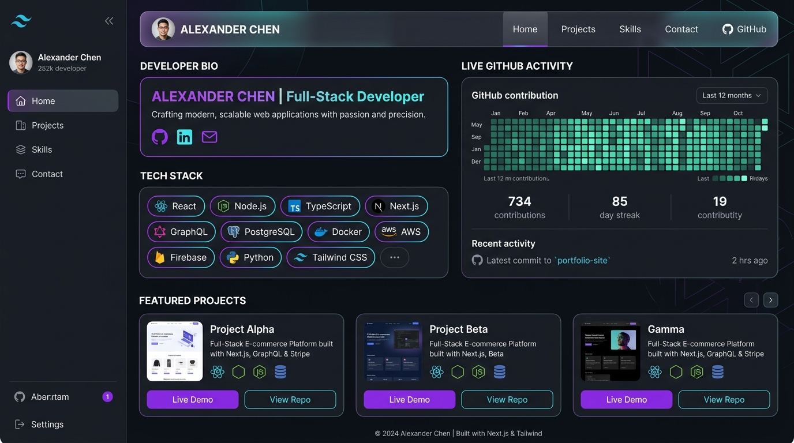

# 🚀 Abhishek's Developer Portfolio & Projects Showcase

A state-of-the-art full-stack developer portfolio application featuring **live GitHub sync**, interactive project demo simulators, dark glassmorphism design, and backend REST APIs.



---

## 🌟 Overview & Key Highlights

- **Live GitHub Integration**: Automatically syncs public repositories, star counts, forks, and contribution activity graph.
- **Interactive Project Demos**: Test live working simulations of featured projects directly inside the application.
- **Full-Stack Architecture**: Next.js 14 frontend with Tailwind CSS + Express.js Node.js backend.
- **Contact Mailer & Security**: Rate-limited contact form API supporting Nodemailer with Gmail SMTP.

---

## 📁 Featured Projects Showcase

### 1. DevConnect — Developer Collaboration Platform
> A full-stack developer workspace platform for posting project ideas, forming teams, managing tasks with real-time Kanban boards, and chatting live.


- **Tech Stack**: React, Node.js, MongoDB, Socket.io, JWT
- **Documentation**: [Read DevConnect README](./projects/devconnect/README.md)
- **Live Demo**: Click **⚡ Interactive Live Demo** on the portfolio projects section.

---

### 2. AI Resume Screener & Candidate Matcher
> Machine Learning and Natural Language Processing (NLP) tool that parses resumes, extracts technical skills, matches candidates against job descriptions, and calculates suitability scores.


- **Tech Stack**: Python, Flask, NLP, Scikit-learn, React
- **Documentation**: [Read AI Resume Screener README](./projects/ai-resume-screener/README.md)
- **Live Demo**: Click **⚡ Interactive Live Demo** on the portfolio projects section.

---

### 3. EduPlatform — Online Learning App
> Modern video streaming course platform with module progress tracking, interactive quizzes, instructor dashboard, and Stripe payment integration.


- **Tech Stack**: Next.js 14, PostgreSQL, Stripe API, AWS S3
- **Documentation**: [Read EduPlatform README](./projects/eduplatform/README.md)
- **Live Demo**: Click **⚡ Interactive Live Demo** on the portfolio projects section.

---

## 🛠 Tech Stack Overview

| Layer | Technology |
|-------|------------|
| **Frontend** | Next.js 14, TypeScript, React 18, Tailwind CSS, Lucide Icons |
| **Backend** | Node.js, Express.js, Cors, Helmet |
| **GitHub API** | REST API v3 (Profile, Repositories, Star Stats) |
| **Email Service** | Nodemailer + Gmail SMTP |
| **Deployments** | Vercel (Frontend), Railway (Backend) |

---

## 🚀 Quick Start & Running Locally

### 1. Clone Repository & Install Dependencies
```bash
git clone https://github.com/jhasabhishek17/abhishek-portfolio.git
cd abhishek-portfolio

# Install backend dependencies
cd backend && npm install

# Install frontend dependencies
cd ../frontend && npm install
```

### 2. Configure Environment Variables
- **Backend (`backend/.env`)**:
```env
PORT=5001
GITHUB_USERNAME=jhasabhishek17
FRONTEND_URL=http://localhost:3000
```

- **Frontend (`frontend/.env.local`)**:
```env
NEXT_PUBLIC_GITHUB_USERNAME=jhasabhishek17
NEXT_PUBLIC_BACKEND_URL=http://localhost:5001
NEXT_PUBLIC_SITE_URL=http://localhost:3000
```

### 3. Start Development Servers

```bash
# Terminal 1 — Start Backend API Server
cd backend && npm run dev     # Running on http://localhost:5001

# Terminal 2 — Start Frontend Application
cd frontend && npm run dev    # Running on http://localhost:3000
```

---

## 📄 License & Attribution

Developed with ❤️ by **Abhishek**. Free to customize for personal portfolios.
