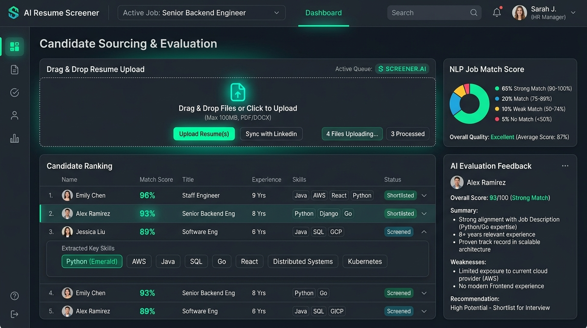

# 🤖 AI Resume Screener & Candidate Matcher

> Machine Learning and Natural Language Processing (NLP) tool that parses resumes, extracts technical skills, matches candidates against job descriptions, and calculates suitability scores.



---

## ⚡ Key Features

- **NLP Keyword & Skill Extraction**: Automatically parses unstructured resume text to detect technical proficiencies (Python, Docker, React, AWS, SQL).
- **Match Score Calculator**: Generates candidate match percentage scores (e.g. 94%) using cosine similarity and skill density metrics.
- **Skill Gap Analysis**: Highlights matched qualifications alongside recommended skill additions.
- **AI Recommendation Engine**: Produces actionable hiring recommendations for recruiters and engineering managers.

---

## 🛠 Tech Stack

| Layer | Technology |
|-------|------------|
| **NLP Engine** | Python, NLTK, Scikit-learn, SpaCy |
| **API Server** | FastAPI / Flask (Python) & Express (Node.js) |
| **Frontend** | React, TypeScript, Tailwind CSS |

---

## 🚀 Quick Start & Installation

```bash
# Clone project repository
git clone https://github.com/jhasabhishek17/abhishek-portfolio.git
cd abhishek-portfolio

# Start Portfolio backend
cd backend && npm install && npm run dev

# Open Portfolio frontend & launch interactive screener
cd ../frontend && npm install && npm run dev
```

Visit `http://localhost:3000/#projects` and click **⚡ Interactive Live Demo** on the AI Resume Screener card!
