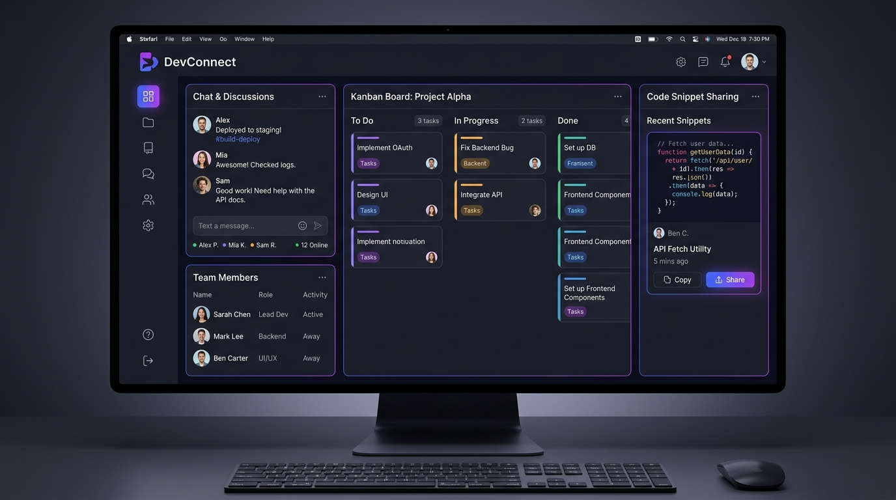

# 🌐 DevConnect — Developer Collaboration Platform

> A full-stack developer workspace platform for posting project ideas, forming teams, managing tasks with real-time Kanban boards, and chatting live.



---

## ⚡ Key Features

- **Real-Time Workspace Chat**: Built with Socket.io & REST APIs for instantaneous multi-developer team communication.
- **Interactive Kanban Task Manager**: Categorize tasks into *To Do*, *In Progress*, and *Done* with real-time status syncing.
- **Developer Directory & Profile Matching**: Filter developers by technical skills (React, Node.js, Python, DevOps) and availability status.
- **JWT & Role-Based Security**: Authenticate developers with JWT tokens and secure authorization headers.

---

## 🛠 Tech Stack

| Layer | Technology |
|-------|------------|
| **Frontend** | React.js, Next.js, Tailwind CSS, Lucide Icons |
| **Backend** | Node.js, Express.js, Socket.io |
| **Database** | MongoDB, Mongoose ORM |
| **Auth** | JSON Web Tokens (JWT), bcrypt.js |

---

## 🚀 Quick Start & Installation

```bash
# Clone project repository
git clone https://github.com/jhasabhishek17/abhishek-portfolio.git
cd abhishek-portfolio

# Start DevConnect API backend
cd backend && npm install && npm run dev

# Start Frontend & launch interactive demo
cd ../frontend && npm install && npm run dev
```

Visit `http://localhost:3000/#projects` and click **⚡ Interactive Live Demo** on the DevConnect card!
