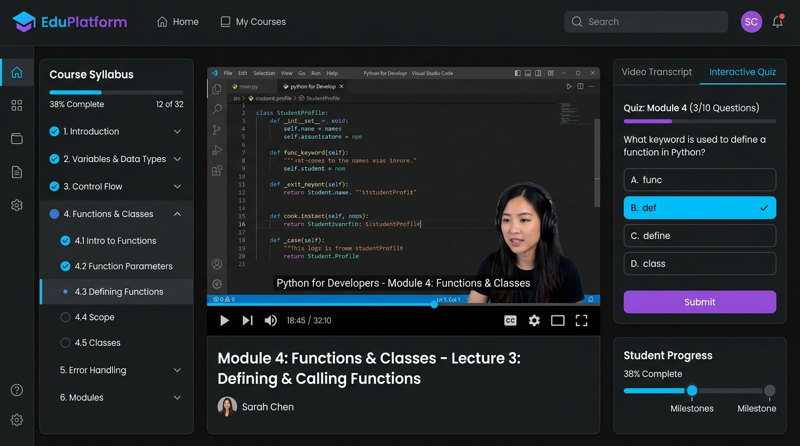

# 📚 EduPlatform — Online Learning App

> Modern video streaming course platform with module progress tracking, interactive quizzes, instructor dashboard, and Stripe payment integration.



---

## ⚡ Key Features

- **HD Video Streaming Interface**: Clean media player interface with module chapter tracking and timestamp navigation.
- **Interactive Knowledge Quizzes**: Test student understanding at the end of each module with real-time feedback.
- **Curriculum Progress Tracker**: Save module completion status dynamically per student.
- **Stripe Checkout Integration**: Seamless enrollment portal supporting credit card and digital wallet payments.

---

## 🛠 Tech Stack

| Layer | Technology |
|-------|------------|
| **Frontend** | Next.js 14, React 18, Tailwind CSS |
| **Database** | PostgreSQL, Prisma ORM |
| **Payments** | Stripe API |
| **Cloud Storage** | AWS S3 (Video asset hosting) |

---

## 🚀 Quick Start & Installation

```bash
# Clone project repository
git clone https://github.com/jhasabhishek17/abhishek-portfolio.git
cd abhishek-portfolio

# Start Portfolio backend
cd backend && npm install && npm run dev

# Open Portfolio frontend & launch interactive demo
cd ../frontend && npm install && npm run dev
```

Visit `http://localhost:3000/#projects` and click **⚡ Interactive Live Demo** on the EduPlatform card!
